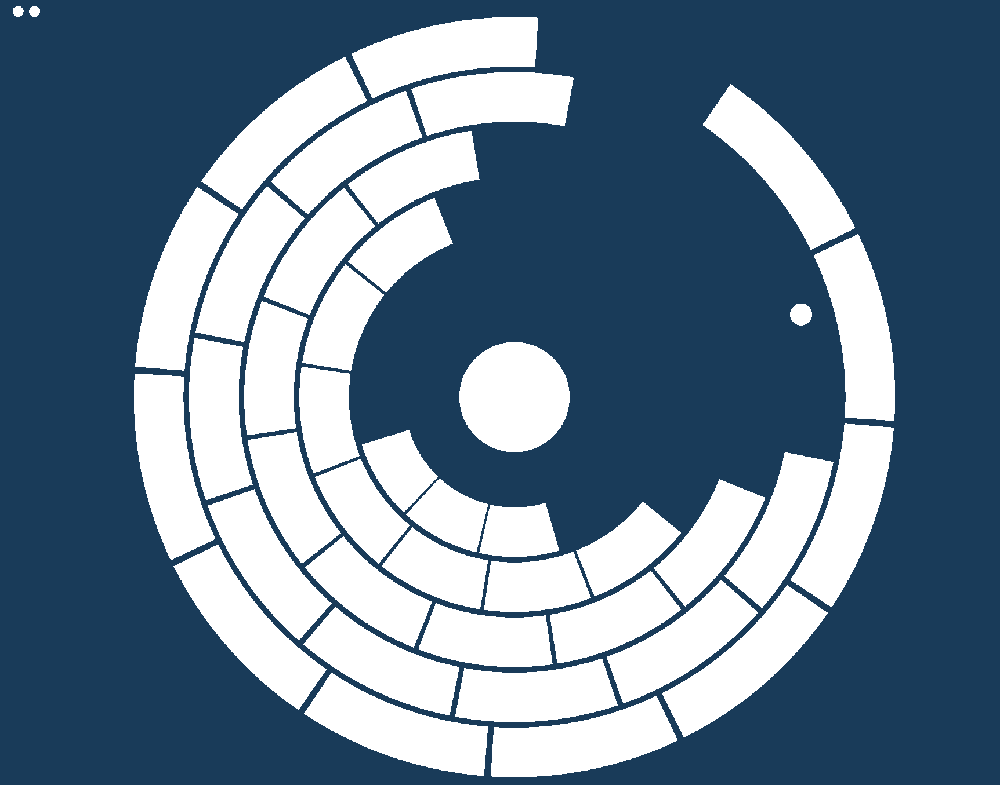

# Breakout with a Twist

Author: George Ralph

Design: This game takes the brick breaking action of Atari's Breakout, and wraps it around a circle. Try to destroy all sectors in each ring without letting the ball fly off the screen!

Screen Shot:

How To Play:

Rotate the rings by moving the mouse cursor around the center circle. Watch out,
the outer rings move a lot slower than the inner rings!

Every time the ball leaves the screen you lose one of three lives. If you break
all the bricks before losing all three lives, you win!

Sources: Circle-circle intersection code largely inspired by the ray-sphere
intersection code found in Scotty3D.

https://cmu-graphics.github.io/Scotty3D/pathtracer/ray_sphere_intersection

Base code written off of
https://github.com/15-466/15-466-f21-base0

This game was built with [NEST](NEST.md).
